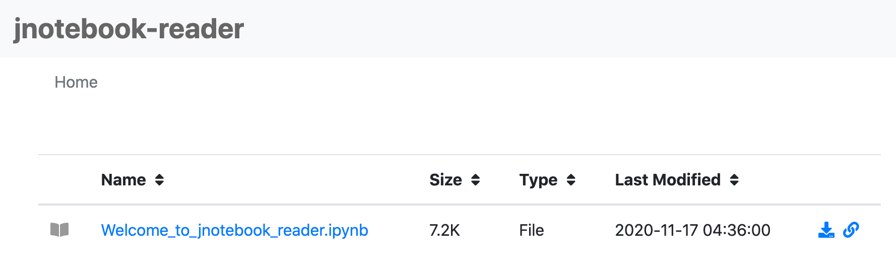
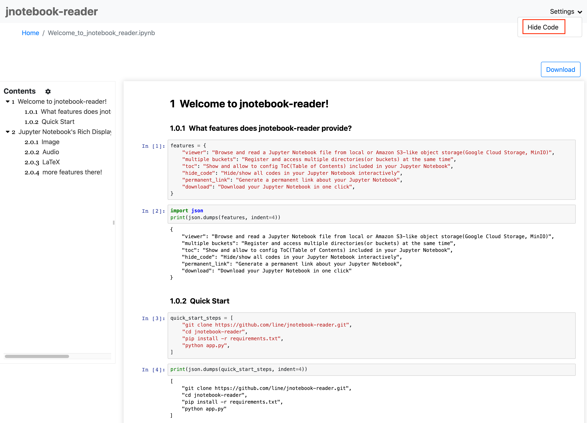

# :black_joker: jnotebook_reader
- Browse and render Jupyter Notebooks from local, Amazon S3, Google Cloud Storage or MinIO
- Register and access multiple directories(or buckets) at the same time
- Show and allow to config ToC(Table of Contents) included in your Jupyter Notebook
- Hide/show all codes in your Jupyter Notebook interactively
- Generate a permanent link about your Jupyter Notebook
- Download your Jupyter Notebook in one click
## :aries: Screenshots

||
| ----------------------------------------- |

||
| ----------------------------------------- |

## :taurus: Runtime Environment Requirement
python 3

## :gemini: Quick Start
```bash
git clone https://github.com/line/jnotebook-reader
cd jnotebook-reader
pip install -r requirements.txt
python app.py
```
## :cancer: How to configure
lib/config.py
```python
"default": {                                  # default config
    "server": {
        "port": 9088,                         # The port server listening on
        "root": "/jupyternb"                  # Context path, base url
    },
    "storage": { # Storage type
        "type": "local",                      # local or s3
        "directories": [                      # If type is local effective
            "/path/foo/bar/1",
            "/path/foo/bar/2"
        ],                                              
        "s3": {                               # s3 config, if type is s3 effective
            "endpoint": None,                 # s3 endpoint, if type is s3 required, if set with None would access to s3 global url
            "accessKey": "YOUR_ACCESS_KEY",   # optional, default; request header "Access-Key" could replace it
            "secretKey": "YOUR_SECRET_KEY",   # optional, default; request header "Secret-Key" could replace it
            "buckets": ["YOUR_BUCKET_NAME"],  # optional, default; request header "Bucket-Name" could replace it
        }
    },
    "logging": {
        "level": logging.DEBUG,
        "format": "%(asctime)s - %(name)s - %(lineno)d - %(levelname)s - %(message)s",
        "filename": "/path/foo/bar/access.log"
    }
}
```
### How to configure for local storage
You can configure multiple directories to be accessed by the jnotebook-viewer at the same time. Depending on your preference, you can set it as list or dict.
#### 1. "list" type
```
"directories": [
    "/path/foo/bar/1",
    "/path/foo/bar/2"
]
```
You can access it like: <br/>
http://localhost:9088/0 <br/>
http://localhost:9088/1
#### 2. "dict" type
```
"directories": {
    "a": "/path/foo/bar/1",
    "b": "/path/foo/bar/2"
}
```
You can access it like: <br/>
http://localhost:9088/a <br/>
http://localhost:9088/b
#### 3. single directory
```
"directories": "/path/foo/bar/1"
```
You can access it like: <br/>
http://localhost:9088/ANY
### How to configure for S3 storage
You can configure multiple buckets to be accessed by the jnotebook-reader at the same time. Depending on your preference, you can set it as list or dict.
#### 1. "list" type
```
"buckets": [
    "bucket_name_1",
    "bucket_name_2"
]
```
You can access it like: <br/>
http://localhost:9088/0 <br/>
http://localhost:9088/1
#### 2. "dict" type
```
"buckets": {
    "a": "bucket_name_1",
    "b": "bucket_name_2"
}
```
You can access it like: <br/>
http://localhost:9088/a <br/>
http://localhost:9088/b
#### 3. single bucket
```
"buckets": "bucket_name_1"
```
You can access it like: <br/>
http://localhost:9088/ANY
### How to configure with environment variables
You can set configuration through environment variables.
if environment variables set, the configuration file will be overwritten accordingly.
```bash
# Storage type, local or s3, default is local
JNOTEBOOK_READER_STORAGE_TYPE = "local"
# s3 endpoint, only for s3 storage type
JNOTEBOOK_READER_S3_ENDPOINT = ""
# s3 access key, only for s3 storage type
AWS_ACCESS_KEY_ID = ""
# s3 secret key, only for s3 storage type
AWS_SECRET_ACCESS_KEY = ""
# s3 bucket name, could set multiple, separated by ',' only for s3 storage type
JNOTEBOOK_READER_S3_BUCKET_NAME = ""
# local directories, could set multiple, separated by ',' only for local storage type
JNOTEBOOK_READER_DIR = ""
```
## :leo: API Spec
### Method
GET http://localhost:9088/:id/(:prefix|:key|:path)
### Path Variable
| Name  | Type  | Description  |
|---|---|---|
| id | string | ID defined by user |
| prefix | string | S3 object prefix |
| key | string | S3 object key |
| path | string | Local file path |
### Headers
| Name  | Type  | Description  |
|---|---|---|
| Access-Key | string | S3 access key id |
| Secret-Key | string | S3 secret access key |
| Bucket-Name | string | S3 bucket name |

### Example
#### s3 with request headers
```
curl -X GET \
  http://localhost:9088/5e26886d36b28f778dddcf0f/folder/test.ipynb \
  -H 'access-key: your_access_key' \
  -H 'bucket-name: test_bucket_name' \
  -H 'secret-key: your_secret_key'
```
#### s3 with config buckets
```
curl -X GET http://localhost:9088/0/folder/test.ipynb
```
#### local
```
curl -X GET http://localhost:9088/1/folder/test.ipynb
```
## :virgo: Production
If you want to release jnotebook_reader as a production service, it is recommended that you install [waitress-serve](https://docs.pylonsproject.org/projects/waitress/en/stable/runner.html) to manage your service.
```bash
git clone https://github.com/line/jnotebook-reader
cd jnotebook-reader
pip install -r requirements.txt
waitress-serve --call --listen=:9088 'app:create_app' &
```
## :aquarius: Docker
```bash
docker build -t jnotebook_reader -f docker/Dockerfile .
docker run -p 9088:9088 \
    -e JNOTEBOOK_READER_SERVER_PORT="9088" \
    -e JNOTEBOOK_READER_STORAGE_TYPE="s3" \
    -e JNOTEBOOK_READER_S3_ENDPOINT="S3_ENDPOINT" \
    -e AWS_ACCESS_KEY_ID="S3_ACCESS_KEY" \
    -e AWS_SECRET_ACCESS_KEY="S3_SECRET_KEY" \
    -e JNOTEBOOK_READER_S3_BUCKET_NAME="S3_BUCKET_NAME_1,S3_BUCKET_NAME_2" \
    -it --rm jnotebook_reader
```

## :pisces: Kubernetes
```bash
# Rollout jnotebook_reader deployment on Kubernetes cluster ( all resources are created in jnotebook-reader namespace )
kubectl apply -f docker/deployment.yml

# Get jnotebook_reader port
The examples deploy a NodePort service, so you have to check for the port it is mapped to:

kubectl get svc -n jnotebook-reader

Use the second port you find in the output to access jnotebook_reader, for instance:

NAME                   TYPE       CLUSTER-IP     EXTERNAL-IP   PORT(S)          AGE
jnotebook-reader-svc   NodePort   172.19.66.29   <none>        9088:30693/TCP   25s

Type in browser -> http://{kubernetes_cluster_ip}:30693

# Destroy all resources
kubectl delete ns jnotebook-reader
```

## :peace_symbol: Contributing

Please see [CONTRIBUTING.md](CONTRIBUTING.md) for contributing to jnotebook-reader.

If you believe you have discovered a vulnerability or have an issue related to security, please DO NOT open a public issue. Instead, send us a mail to [dl_oss_dev@linecorp.com](mailto:dl_oss_dev@linecorp.com).

## :libra: License

```
Copyright 2020 LINE Corporation

LINE Corporation licenses this file to you under the Apache License,
version 2.0 (the "License"); you may not use this file except in compliance
with the License. You may obtain a copy of the License at:

   https://www.apache.org/licenses/LICENSE-2.0

Unless required by applicable law or agreed to in writing, software
distributed under the License is distributed on an "AS IS" BASIS, WITHOUT
WARRANTIES OR CONDITIONS OF ANY KIND, either express or implied. See the
License for the specific language governing permissions and limitations
under the License.
```

See [LICENSE](LICENSE) for more detail. 

